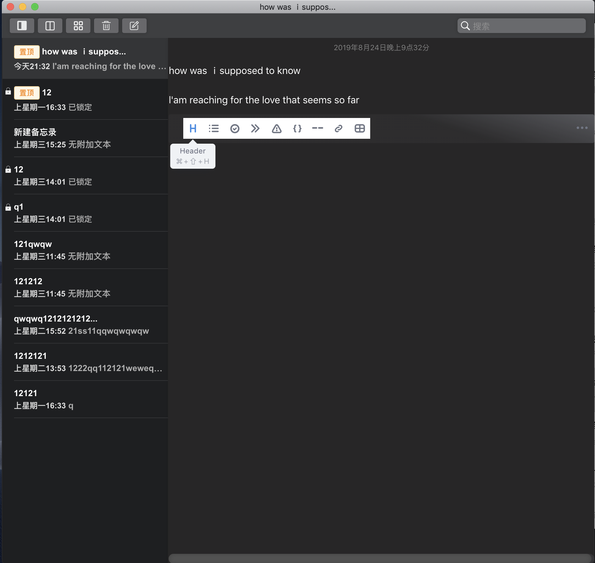
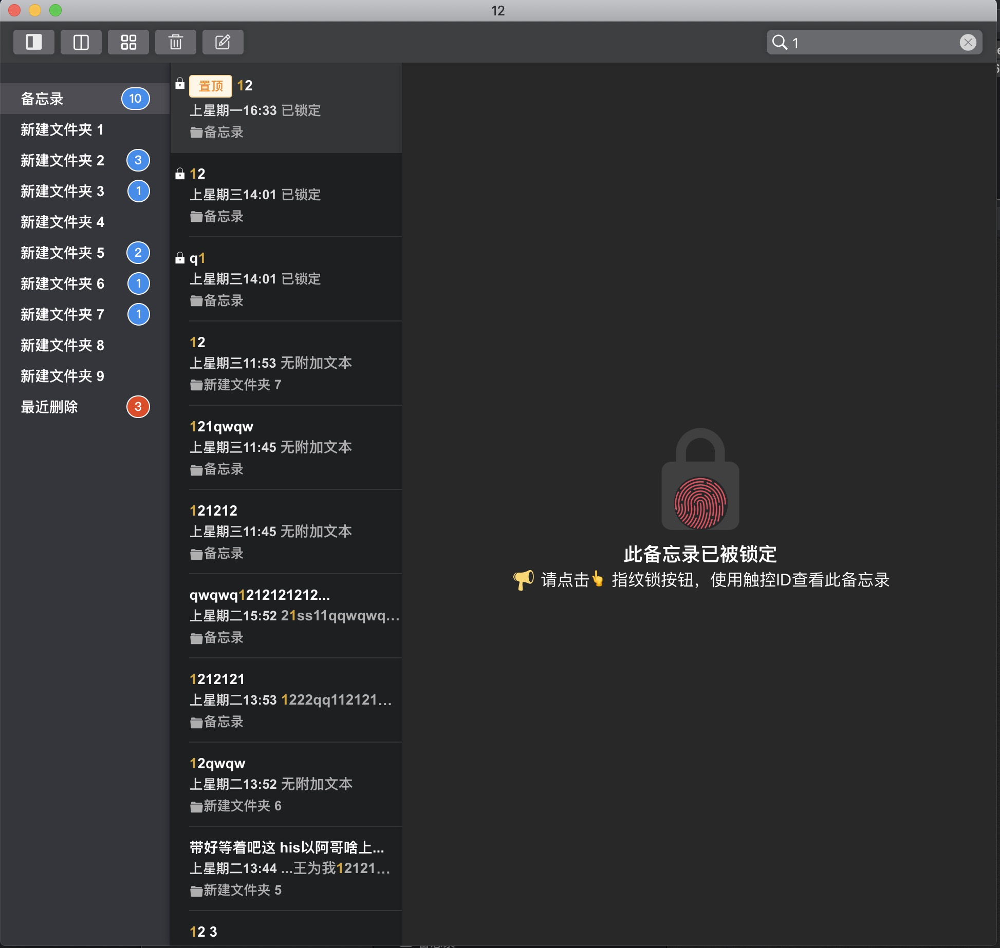
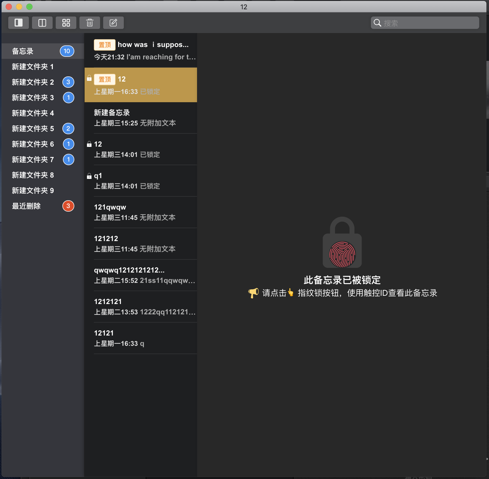

# bloggo
> 我的博客地址： https://gofugui.github.io/
> GitHub免费博客上传与管理工具

## 产品愿景
> 用户可以通过本平台对自己的GitHub Pages进行构建和更新

#### 当前支持的功能有：
    - 文本编辑与记录 ✅ 
#### feature
    - markdown导入导出 
    - 选择主题构建博客主题 
    - 编辑博客内容并上传 
    - 完善项目文档 
#### 图片展示



#### 目前支持的平台 
macOS、Windows
#### Build Setup

``` bash
# install dependencies
npm install or yarn

# serve with hot reload at localhost:9080
npm run dev

# build electron application for production
npm run build

# run unit & end-to-end tests
npm test


# lint all JS/Vue component files in `src/`
npm run lint

```

## 更新日志
> 项目在2019/05/10开始启动

### v1.0.0
项目初始化完成(2019/08/24)

---

This project was generated with [electron-vue](https://github.com/SimulatedGREG/electron-vue)@[8fae476](https://github.com/SimulatedGREG/electron-vue/tree/8fae4763e9d225d3691b627e83b9e09b56f6c935) using [vue-cli](https://github.com/vuejs/vue-cli). Documentation about the original structure can be found [here](https://simulatedgreg.gitbooks.io/electron-vue/content/index.html).
